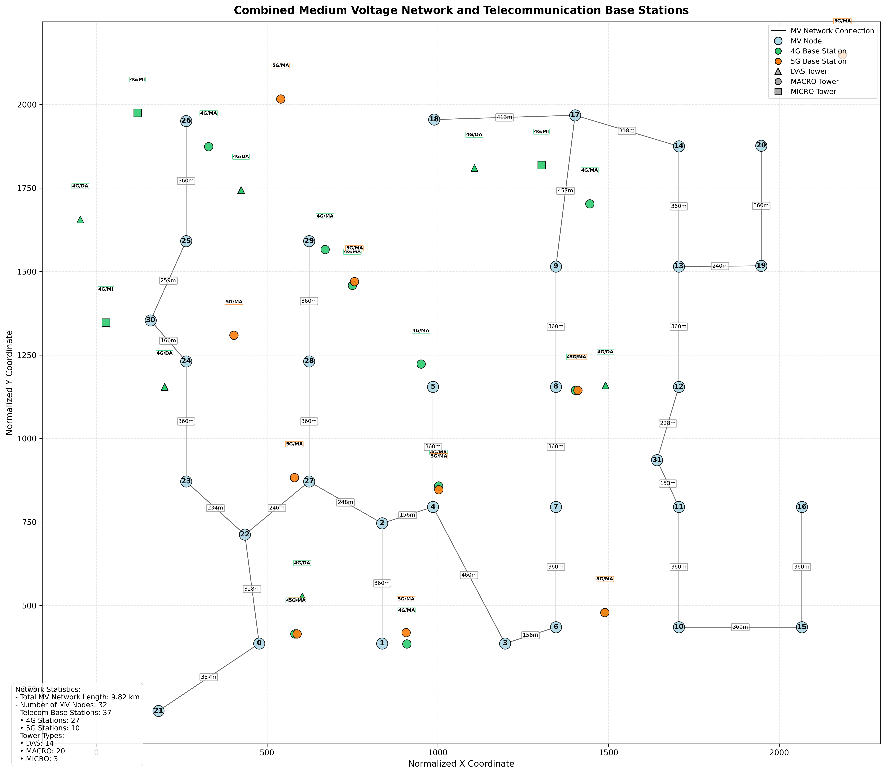
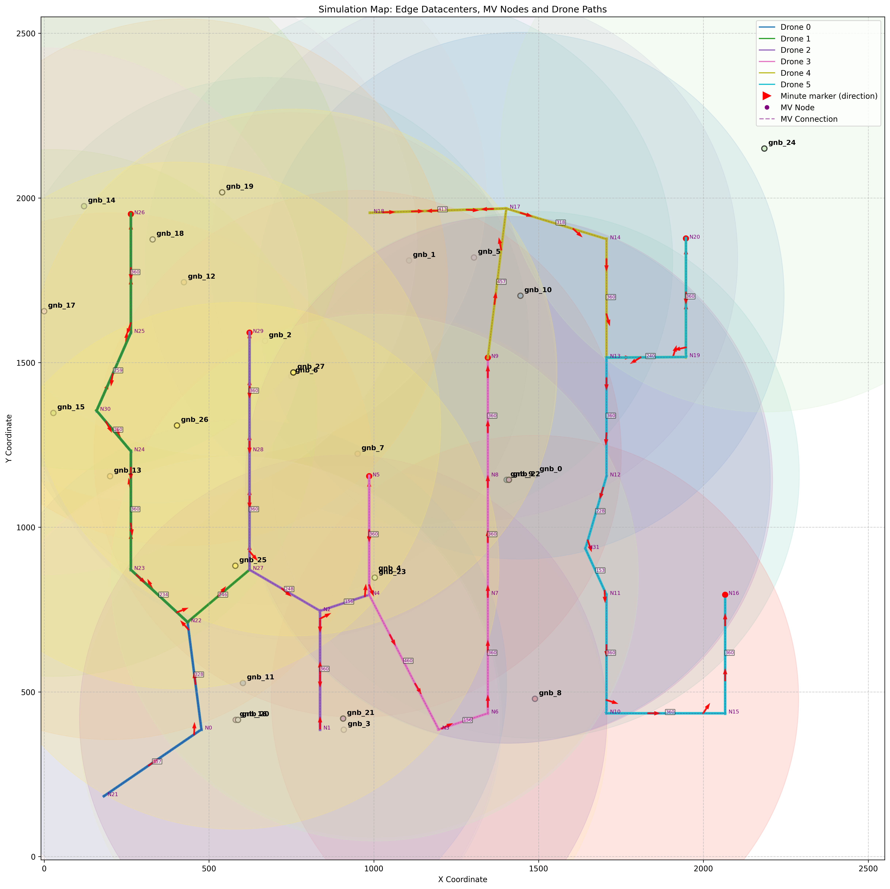

# EdgeSimulator# EdgeSimulator

## Introduction

The EdgeSimulator is a comprehensive framework that combines electrical grid infrastructure with telecommunications networks to simulate edge computing scenarios using drone mobility.

The system initially retrieves geographical coordinates for a target area from OpenStreetMap and generates a GeoJSON polygon around its center. This geographical data is then fed into the DAVE toolkit to create a representative medium-voltage electrical grid network for the area. The system combines this electrical infrastructure with information about 4G/5G base stations (GNBs) in the region, creating a comprehensive network representation. For mobility planning, paths for multiple drones are calculated using a combined algorithmic approach that integrates Dijkstra's shortest path algorithm with worst path analysis, ensuring efficient network coverage. Finally, all network elements and mobility paths are exported in formats compatible with PureEdgeSim, where custom modifications have been implemented to support the specialized mobility model, enabling a scenario where drones generate 15 tasks per second and offload some of them according to a distribution pattern. The offloaded images average 118KB in size with a standard deviation of 63KB, enabling high-fidelity simulation of the defined environment.

## Dependencies

EdgeSimulator relies on two main external components:

### DAVE_core

The Data-driven Automated Virtual Energy grid toolkit is used for generating realistic electrical grid models based on OpenStreetMap data. To use this framework, you need to install the DAVE_core toolkit:

1. Clone or download DAVE_core from: [https://github.com/DaveFoss/DAVE_core](https://github.com/DaveFoss/DAVE_core)
2. Install it using one of these methods:
   - **Option 1 (recommended)**: `pip install dave_core`
   - **Option 2**: `pip install https://github.com/DaveFoss/DAVE_core/archive/main.zip`
   - **Option 3**: Download the repository and run `pip install -e .` within the directory

### PureEdgeSim

PureEdgeSim is used for the edge computing simulation environment. The EdgeSimulator includes a customized version of PureEdgeSim with modifications to support drone mobility and specialized offloading scenarios.

The required files are included in the repository under the `PureEdgeSim` directory and do not need to be installed separately.

## System Workflow: High-Level Abstraction

The EdgeSimulator framework consists of five main phases:

### Phase 1: Geographic Area Definition & Grid Generation
- Retrieve geographic data for city using OpenStreetMap
- Create bounding box with specified radius around city center
- Generate GeoJSON polygon representing the area
- Call DAVE toolkit with GeoJSON as input
- Generate medium-voltage electrical grid with transformer stations
- Save network data as dave_dataset.json

### Phase 2: Network Data Processing
- Parse nodes (transformer stations), connections and coordinates
- Calculate real-world distances between connected nodes
- Read GNB information from JSON files and filter base stations
- Convert MV grid to normalized coordinate system
- Normalize base station coordinates to match grid system
- Save electrical grid data to mv_nodes_info.csv
- Save telecom infrastructure data to gnb_info.csv
- Generate visualization as mv_network_map.png

#### Network Visualization Example:

*Visualization of the electrical grid with telecommunication infrastructure*

### Phase 3: Infrastructure to PureEdgeSim Conversion
- Load GNB locations and properties from gnb_info.csv
- Filter out duplicate GNBs at same locations
- Create datacenter entries with appropriate coordinates for each GNB
- Configure processing capacity based on GNB type (MACRO, MICRO, DAS)
- Set network parameters (latency, bandwidth) based on technology (4G/5G)
- Generate edge_datacenters.xml in PureEdgeSim format

### Phase 4: Edge Device Path Planning
- Load MV network topology from mv_nodes_info.csv
- Create graph representation with nodes and distances as weights
- Determine starting point in the electrical grid network
- Generate path that covers all nodes with minimum total distance
- Split path into multiple balanced segments based on distance
- Add overlapping points between adjacent drone segments
- Format and save path data as drone_path.csv

### Phase 5: Simulation Integration
- Configure PureEdgeSim with edge_datacenters.xml for infrastructure
- Use drone_path.csv for edge device mobility patterns
- Run simulation with configured infrastructure and mobility models
- Collect and analyze performance metrics and coverage efficiency
- Generate visualizations and reports of simulation results

#### Simulation Result Example:

*Sample visualization of a completed simulation showing drone paths and network coverage*

## Pseudo Codes

### CreateCityNetwork
- Use OSM to retrieve geographic data for the target city
- Create a bounding box with radius around city center
- Download road network data from OpenStreetMap
- Generate GeoJSON polygon representing the area
- Call DAVE toolkit to create electrical grid
- Return path to GeoJSON and dave_dataset.json files

### ProcessNetworkData
- Extract MV network data from dave_dataset.json
- Process network topology (calculate distances, create edge matrix)
- Extract telecommunications infrastructure from data files
- Generate output files (mv_nodes_info.csv, gnb_info.csv)
- Calculate network statistics
- Return network data structures and statistics

### ConvertGnbToXml
- Load GNB data from gnb_info.csv
- Initialize empty XML structure for edge datacenters
- Filter out GNBs with duplicate normalized coordinates
- Generate datacenter entries for each unique GNB
- Define network topology
- Output complete XML to edge_datacenters.xml
- Return path to generated XML file

### CreateDronePaths
- Load MV network topology from mv_nodes_info.csv
- Create graph representation of the electrical grid
- Find leaf nodes and paths from starting node to all leaf nodes
- Identify highest-cost path based on total distance
- Create an optimized path that covers all nodes
- Divide the path among multiple drones
- Generate drone_path.csv
- Return path data in CSV format for PureEdgeSim mobility model

## Scripts and Fast Run

The EdgeSimulator provides several scripts for easy execution of the simulation:

### d_run_simulation.sh
This script runs a single simulation with customizable parameters:
- Number of devices
- Offload probability
- Simulation time
- Map dimensions and coverage parameters

The script updates the configuration files, compiles the project, and executes the simulation.

### d_run_m_simulation.sh
This script runs multiple simulations with different offload probabilities in sequence:
- Configurable number of devices and simulation time
- Tests multiple offload probabilities (0.03, 0.05, 0.09, 0.12, 0.18, 0.20, 0.27, 0.34, 0.45, 100)
- Creates separate output folders for each simulation

### run_all.sh
This script executes the entire workflow from network generation to simulation:
1. Creates the city network (optional via RUN_CITY_NETWORK flag)
2. Processes network data
3. Converts GNB to XML
4. Runs the simulation

**Note:** The script includes a configuration variable `RUN_CITY_NETWORK` (boolean) at the top. If you already have a dave_dataset.json file from a previous run, you can set this to `false` to skip the time-consuming city network creation step.

### Running the Scripts

On Linux systems, you can run these scripts with:

```bash
chmod +x run_all.sh && ./run_all.sh
```

Similarly for other scripts:

```bash
chmod +x d_run_simulation.sh && ./d_run_simulation.sh
chmod +x d_run_m_simulation.sh && ./d_run_m_simulation.sh
```

Make sure to run each script from its appropriate directory.